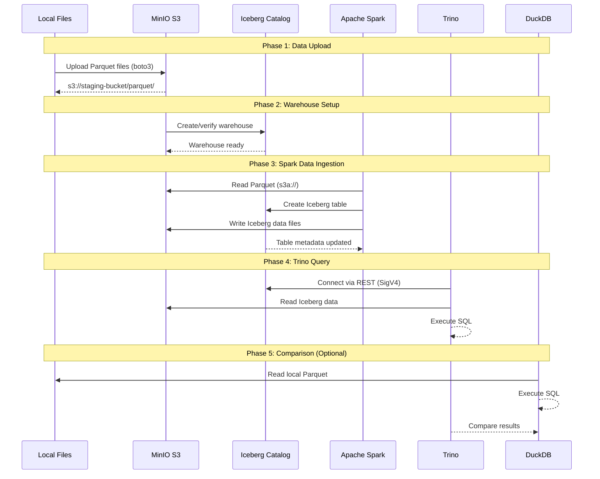

# AIStor Tables Integration Test Guide

## Overview

This document describes the `run_trino_analysis.py` test script, which demonstrates end-to-end integration of **MinIO AIStor Tables** (native Apache Iceberg REST Catalog) with **Apache Spark** for data ingestion and **Trino** for distributed SQL analytics.

### Purpose

The test validates:
1. Data ingestion into Iceberg tables via Spark
2. SQL querying via Trino with AIStor's native Iceberg REST Catalog
3. Performance comparison between Trino/Iceberg and DuckDB

### Key Technologies

| Component | Role | Version |
|-----------|------|---------|
| MinIO AIStor | Object storage + Iceberg REST Catalog | Latest |
| Apache Spark | Data ingestion (Parquet → Iceberg) | 4.0 / 3.5 |
| Trino | Distributed SQL query engine | 477 |
| Apache Iceberg | Table format | 1.10.1 / 1.9.1 |
| DuckDB | Local SQL engine (comparison) | Latest |

---

## Architecture

### System Overview

```
┌─────────────────────────────────────────────────────────────────────────────┐
│                         AIStor Tables Test Architecture                      │
├─────────────────────────────────────────────────────────────────────────────┤
│                                                                              │
│   ┌──────────────┐      ┌──────────────────────────────────────────────┐    │
│   │ Local Files  │      │              MinIO AIStor                    │    │
│   │  (Parquet)   │      │  ┌────────────────┐  ┌────────────────────┐  │    │
│   │  424 files   │──────│▶ │ Staging Bucket │  │  Iceberg Warehouse │  │    │
│   │  4.2 GB      │      │  │ (parquet/)     │  │  (trinotutorial)   │  │    │
│   └──────────────┘      │  └────────────────┘  └────────────────────┘  │    │
│          │              │          │                    ▲              │    │
│          │              │          │         ┌──────────┴──────────┐   │    │
│          ▼              │          │         │ Iceberg REST Catalog│   │    │
│   ┌──────────────┐      │          │         │   /_iceberg/v1/...  │   │    │
│   │    Spark     │──────│──────────┘         └─────────────────────┘   │    │
│   │  Session     │      │                              ▲               │    │
│   │  (PySpark)   │      │                              │               │    │
│   └──────────────┘      │                              │  SigV4 Auth   │    │
│          │              │                              │               │    │
│          │ Write        │                              │               │    │
│          ▼ Iceberg      │                              │               │    │
│   ┌──────────────┐      │                     ┌────────┴───────┐       │    │
│   │    Trino     │◀─────│─────────────────────│   REST API     │       │    │
│   │   Cluster    │      │                     │  Connector     │       │    │
│   │              │      │                     └────────────────┘       │    │
│   └──────────────┘      │                                              │    │
│          │              └──────────────────────────────────────────────┘    │
│          │ SQL Query                                                         │
│          ▼                                                                   │
│   ┌──────────────┐      ┌──────────────┐                                    │
│   │   Results    │      │    DuckDB    │──── Local Parquet Query            │
│   │  Comparison  │◀─────│  (Optional)  │                                    │
│   └──────────────┘      └──────────────┘                                    │
│                                                                              │
└─────────────────────────────────────────────────────────────────────────────┘
```

### Data Flow



---

## Deployment

### Docker Compose Stack

The test uses two Docker Compose configurations:

#### 1. Quickstart (Single Trino Instance)

**File**: `docker-compose-quickstart.yaml`

```yaml
services:
  minio:
    image: ${MINIO_TEST_IMAGE}
    ports:
      - "9000:9000"   # S3 API
      - "9001:9001"   # Console
    environment:
      MINIO_LICENSE: ${MINIO_LICENSE}
      MINIO_ROOT_USER: minioadmin
      MINIO_ROOT_PASSWORD: minioadmin

  trino:
    image: trinodb/trino:477
    ports:
      - "9999:8080"   # Trino REST API
    environment:
      CATALOG_MANAGEMENT: dynamic

  jupyter:
    image: quay.io/jupyter/pyspark-notebook:2024-10-14
    ports:
      - "8888:8888"   # Jupyter Notebook
```

**Start Command**:
```bash
cd aistor-tables-docs
docker compose -f docker-compose-quickstart.yaml up -d
```

#### 2. Trino Cluster (Multi-Node)

**File**: `docker-compose-trino-cluster.yaml`

```yaml
services:
  minio:
    # Same as quickstart

  trino-coordinator:
    image: trinodb/trino:477
    hostname: trino-coordinator
    ports:
      - "9999:8080"
    volumes:
      - ./trino-config/coordinator/config.properties:/etc/trino/config.properties
      - ./trino-config/coordinator/node.properties:/etc/trino/node.properties

  trino-worker-1:
    image: trinodb/trino:477
    hostname: trino-worker-1
    volumes:
      - ./trino-config/worker/config.properties:/etc/trino/config.properties
      - ./trino-config/worker/node.properties.worker1:/etc/trino/node.properties

  trino-worker-2:
    # Similar to worker-1

  trino-worker-3:
    # Similar to worker-1
```

**Start Command**:
```bash
docker compose -f docker-compose-trino-cluster.yaml up -d
```

### Network Architecture

```
┌─────────────────────────────────────────────────────────────────────┐
│                      Docker Network: iceberg_tests                   │
├─────────────────────────────────────────────────────────────────────┤
│                                                                      │
│  ┌─────────────────┐                     ┌─────────────────────┐    │
│  │   Host Machine  │                     │   minio (container) │    │
│  │                 │                     │                     │    │
│  │  Python Script  │───localhost:9000───▶│  S3: 9000           │    │
│  │  (run_trino_    │                     │  Console: 9001      │    │
│  │   analysis.py)  │                     │                     │    │
│  │                 │                     │  hostname: minio    │    │
│  └─────────────────┘                     └─────────────────────┘    │
│          │                                        ▲                  │
│          │                                        │                  │
│          │ localhost:9999                         │ minio:9000       │
│          ▼                                        │ (internal)       │
│  ┌─────────────────────────────────────────────────────────────┐    │
│  │                    Trino Container                           │    │
│  │                                                              │    │
│  │  Trino connects to MinIO using Docker service name:          │    │
│  │    iceberg.rest-catalog.uri = 'http://minio:9000/_iceberg'   │    │
│  │    s3.endpoint = 'http://minio:9000'                         │    │
│  │                                                              │    │
│  │  NOT localhost:9000 (that would be the Trino container!)     │    │
│  └──────────────────────────────────────────────────────────────┘    │
│                                                                      │
└──────────────────────────────────────────────────────────────────────┘

CRITICAL: The script uses TWO different MinIO hostnames:
  - MINIO_HOST = "http://localhost:9000"      (for Python/Spark on host)
  - MINIO_HOST_FOR_TRINO = "http://minio:9000" (for Trino in Docker)
```

---

## Spark Configuration

### Complete Spark Session Setup

Spark is configured to connect to AIStor's Iceberg REST Catalog with SigV4 authentication:

```python
spark = (
    SparkSession.builder
    .appName("AIStor Tables - Trino Analysis")
    
    # JAR Dependencies
    .config("spark.jars.packages",
            "org.apache.iceberg:iceberg-spark-runtime-4.0_2.13:1.10.1,"
            "org.apache.iceberg:iceberg-aws-bundle:1.10.1,"
            "org.apache.hadoop:hadoop-aws:3.3.4")
    
    # Iceberg SQL Extensions
    .config("spark.sql.extensions",
            "org.apache.iceberg.spark.extensions.IcebergSparkSessionExtensions")
    
    # Catalog Configuration
    .config("spark.sql.catalog.tutorial_catalog", "org.apache.iceberg.spark.SparkCatalog")
    .config("spark.sql.catalog.tutorial_catalog.type", "rest")
    .config("spark.sql.catalog.tutorial_catalog.uri", "http://localhost:9000/_iceberg")
    .config("spark.sql.catalog.tutorial_catalog.warehouse", "trinotutorial")
    
    # REST Endpoint Credentials (for SigV4)
    .config("spark.sql.catalog.tutorial_catalog.rest.endpoint", "http://localhost:9000")
    .config("spark.sql.catalog.tutorial_catalog.rest.access-key-id", "minioadmin")
    .config("spark.sql.catalog.tutorial_catalog.rest.secret-access-key", "minioadmin")
    
    # SigV4 Authentication
    .config("spark.sql.catalog.tutorial_catalog.rest.sigv4-enabled", "true")
    .config("spark.sql.catalog.tutorial_catalog.rest.signing-name", "s3tables")
    .config("spark.sql.catalog.tutorial_catalog.rest.signing-region", "us-east-1")
    
    # S3 Data Access
    .config("spark.sql.catalog.tutorial_catalog.s3.access-key-id", "minioadmin")
    .config("spark.sql.catalog.tutorial_catalog.s3.secret-access-key", "minioadmin")
    .config("spark.sql.catalog.tutorial_catalog.s3.endpoint", "http://localhost:9000")
    .config("spark.sql.catalog.tutorial_catalog.s3.path-style-access", "true")
    
    # S3A Filesystem (for reading Parquet from S3)
    .config("spark.hadoop.fs.s3a.endpoint", "localhost:9000")
    .config("spark.hadoop.fs.s3a.access.key", "minioadmin")
    .config("spark.hadoop.fs.s3a.secret.key", "minioadmin")
    .config("spark.hadoop.fs.s3a.path.style.access", "true")
    .config("spark.hadoop.fs.s3a.impl", "org.apache.hadoop.fs.s3a.S3AFileSystem")
    .config("spark.hadoop.fs.s3a.connection.ssl.enabled", "false")
    .config("spark.hadoop.fs.s3a.aws.credentials.provider",
            "org.apache.hadoop.fs.s3a.SimpleAWSCredentialsProvider")
    
    # S3A Timeouts (MUST be numeric, not duration strings!)
    .config("spark.hadoop.fs.s3a.connection.timeout", "60000")
    .config("spark.hadoop.fs.s3a.connection.establish.timeout", "60000")
    .config("spark.hadoop.fs.s3a.multipart.purge.age", "86400")
    
    .getOrCreate()
)
```

### Key Configuration Groups

| Group | Purpose | Critical Settings |
|-------|---------|-------------------|
| **JAR Dependencies** | Load Iceberg + S3 support | `iceberg-spark-runtime`, `iceberg-aws-bundle`, `hadoop-aws` |
| **Catalog** | Connect to AIStor | `type=rest`, `uri`, `warehouse` |
| **REST Auth** | SigV4 for catalog API | `sigv4-enabled`, `signing-name`, credentials |
| **S3 Access** | Read/write data files | `s3.endpoint`, `s3.path-style-access`, credentials |
| **S3A Hadoop** | Read Parquet from staging | `fs.s3a.endpoint`, `fs.s3a.path.style.access` |

### Java Version Compatibility

**CRITICAL**: Spark requires Java 8-21. Java 24+ causes:
```
java.lang.UnsupportedOperationException: getSubject is not supported
```

**Fix**:
```bash
# Install Java 21
brew install openjdk@21

# Set JAVA_HOME
export JAVA_HOME=/opt/homebrew/opt/openjdk@21
export PATH="$JAVA_HOME/bin:$PATH"
```

---

## Trino Configuration

### Dynamic Catalog Creation

Trino connects to AIStor using a dynamically created Iceberg catalog:

```sql
CREATE CATALOG tutorial_catalog USING iceberg
WITH (
    -- Catalog Type
    "iceberg.catalog.type" = 'rest',
    "iceberg.rest-catalog.uri" = 'http://minio:9000/_iceberg',
    "iceberg.rest-catalog.warehouse" = 'trinotutorial',
    
    -- Security (SigV4)
    "iceberg.rest-catalog.security" = 'SIGV4',
    "iceberg.rest-catalog.signing-name" = 's3tables',
    "iceberg.rest-catalog.vended-credentials-enabled" = 'true',
    "iceberg.rest-catalog.view-endpoints-enabled" = 'true',
    
    -- Table Location
    "iceberg.unique-table-location" = 'true',
    
    -- S3 Configuration
    "s3.region" = 'dummy',
    "s3.aws-access-key" = 'minioadmin',
    "s3.aws-secret-key" = 'minioadmin',
    "s3.endpoint" = 'http://minio:9000',
    "s3.path-style-access" = 'true',
    
    -- Filesystem
    "fs.hadoop.enabled" = 'false',
    "fs.native-s3.enabled" = 'true'
);
```

### Key Properties Explained

| Property | Value | Purpose |
|----------|-------|---------|
| `iceberg.catalog.type` | `rest` | Use Iceberg REST Catalog protocol |
| `iceberg.rest-catalog.uri` | `http://minio:9000/_iceberg` | AIStor catalog endpoint |
| `iceberg.rest-catalog.security` | `SIGV4` | AWS-style authentication |
| `iceberg.rest-catalog.signing-name` | `s3tables` | AIStor-specific service name |
| `iceberg.rest-catalog.vended-credentials-enabled` | `true` | Get S3 creds from catalog |
| `s3.path-style-access` | `true` | Required for MinIO |
| `fs.native-s3.enabled` | `true` | Use Trino's native S3 (faster) |

### Trino Cluster Configuration

For multi-node Trino:

**Coordinator** (`trino-config/coordinator/config.properties`):
```properties
coordinator=true
node-scheduler.include-coordinator=false
http-server.http.port=8080
discovery.uri=http://trino-coordinator:8080
```

**Worker** (`trino-config/worker/config.properties`):
```properties
coordinator=false
http-server.http.port=8080
discovery.uri=http://trino-coordinator:8080
```

---

## Test Execution Flow

### Step-by-Step Process

```
┌────────────────────────────────────────────────────────────────────────┐
│                        Test Execution Flow                              │
├────────────────────────────────────────────────────────────────────────┤
│                                                                         │
│  1. INITIALIZATION                                                      │
│     ├── Load configuration from environment variables                   │
│     ├── Validate PARQUET_DIR exists                                     │
│     └── Find Parquet files (424 files, 4.2GB)                          │
│                                                                         │
│  2. UPLOAD TO MINIO                                                     │
│     ├── Create staging bucket (trinotutorial-staging)                  │
│     ├── Upload Parquet files to s3://staging-bucket/parquet/           │
│     └── Return S3 path prefix                                          │
│                                                                         │
│  3. WAREHOUSE SETUP                                                     │
│     ├── Create bucket if not exists                                    │
│     ├── Check warehouse via Iceberg REST API                           │
│     └── Create warehouse with upgrade-existing=true                    │
│                                                                         │
│  4. SPARK DATA INGESTION                                                │
│     ├── Create Spark session with AIStor catalog                       │
│     ├── Create namespace: taxi_analysis                                │
│     ├── Read Parquet from s3a://staging-bucket/parquet/                │
│     ├── Write to Iceberg: tutorial_catalog.taxi_analysis.taxi_trips    │
│     └── Verify row count                                               │
│                                                                         │
│  5. TRINO CATALOG SETUP                                                 │
│     ├── Connect to Trino                                               │
│     ├── DROP CATALOG IF EXISTS (ensure fresh config)                   │
│     ├── CREATE CATALOG with AIStor properties                          │
│     └── Verify schema and table visibility                             │
│                                                                         │
│  6. QUERY EXECUTION                                                     │
│     ├── Run analysis query on Iceberg table                            │
│     ├── Measure execution time                                         │
│     └── Collect results                                                │
│                                                                         │
│  7. COMPARISON (Optional)                                               │
│     ├── Run same query via DuckDB on local Parquet                     │
│     ├── Compare execution times                                        │
│     └── Verify result consistency                                      │
│                                                                         │
│  8. RESULTS                                                             │
│     ├── Print formatted results table                                  │
│     ├── Display performance metrics                                    │
│     └── Show comparison summary                                        │
│                                                                         │
└────────────────────────────────────────────────────────────────────────┘
```

### Analysis Query

The test runs this aggregation query on both engines:

```sql
SELECT 
    company, 
    count(*) as trip_count, 
    sum(fare) as total_fare, 
    sum(fare)/count(*) as avg_fare
FROM tutorial_catalog.taxi_analysis.taxi_trips_iceberg
GROUP BY company
ORDER BY trip_count DESC
```

---

## Environment Variables

| Variable | Default | Description |
|----------|---------|-------------|
| `TRINO_URI` | `http://localhost:8080` | Trino REST API endpoint |
| `MINIO_HOST` | `http://localhost:9000` | MinIO S3 endpoint (for Python/Spark) |
| `MINIO_HOST_FOR_TRINO` | `http://minio:9000` | MinIO endpoint for Trino (Docker) |
| `MINIO_ACCESS_KEY` | `minioadmin` | MinIO access key |
| `MINIO_SECRET_KEY` | `minioadmin` | MinIO secret key |
| `WAREHOUSE` | `trinotutorial` | Iceberg warehouse name |
| `PARQUET_DIR` | `./data/parquet` | Local Parquet files directory |
| `COMPARE_WITH_DUCKDB` | `false` | Enable DuckDB comparison |
| `EXECUTION_MODE` | `local` | Execution mode (local/docker) |

---

## Troubleshooting

### Common Issues

#### 1. "Cannot obtain metadata" Error

**Symptom**:
```
TrinoExternalError: ICEBERG_CATALOG_ERROR: Cannot obtain metadata
```

**Cause**: Trino is trying to reach MinIO using `localhost:9000` instead of `minio:9000`.

**Fix**: Ensure `MINIO_HOST_FOR_TRINO` is set to `http://minio:9000` in the Trino catalog creation.

#### 2. Spark Java Compatibility

**Symptom**:
```
java.lang.UnsupportedOperationException: getSubject is not supported
```

**Cause**: Java 24+ is incompatible with Spark/Hadoop.

**Fix**: Use Java 8-21:
```bash
export JAVA_HOME=/opt/homebrew/opt/openjdk@21
```

#### 3. S3A NumberFormatException

**Symptom**:
```
java.lang.NumberFormatException: For input string: "60s"
```

**Cause**: S3A properties expect numeric values, not duration strings.

**Fix**: Use milliseconds:
```python
.config("spark.hadoop.fs.s3a.connection.timeout", "60000")  # Not "60s"
```

#### 4. Warehouse Already Exists

**Symptom**:
```
warehouse name 'trinotutorial' is invalid
```

**Fix**: The script uses `upgrade-existing=True` to convert existing buckets to warehouses.

### Validation Commands

```bash
# Check MinIO health
curl http://localhost:9000/minio/health/live

# Check Trino health
curl http://localhost:9999/v1/status

# List warehouses via Iceberg REST API
curl -X GET http://localhost:9000/_iceberg/v1/warehouses \
  -H "Authorization: AWS4-HMAC-SHA256 ..."

# Trino CLI query
docker exec -it trino trino --execute "SHOW CATALOGS"
```

---

## Performance Results

### Test Environment

- **Dataset**: ~58 million taxi trips
- **Files**: 424 Parquet files (4.2GB total)
- **Query**: GROUP BY company with aggregations

### Results

| Engine | Execution Time | Notes |
|--------|----------------|-------|
| **DuckDB** | 0.193s | Local, single-threaded |
| **Trino/Iceberg** | 0.465s | Single node, via REST catalog |

**Observations**:
- DuckDB is ~2.4x faster for single-node local queries
- Trino advantage emerges with distributed workloads and larger datasets
- Iceberg provides ACID, time travel, schema evolution (not tested here)

---

## Files Reference

| File | Purpose |
|------|---------|
| `run_trino_analysis.py` | Main test script |
| `run_trino_analysis.sh` | Shell wrapper with env vars |
| `docker-compose-quickstart.yaml` | Single Trino deployment |
| `docker-compose-trino-cluster.yaml` | Multi-node Trino cluster |
| `trino-config/coordinator/` | Trino coordinator config |
| `trino-config/worker/` | Trino worker config |

---

## Conclusion

This test demonstrates a complete data lakehouse architecture using:

1. **MinIO AIStor** as unified object storage with native Iceberg catalog
2. **Apache Spark** for scalable data ingestion
3. **Trino** for interactive SQL analytics
4. **Apache Iceberg** as the open table format

The architecture enables:
- **Decoupled storage and compute**
- **Multiple query engines** on the same data
- **ACID transactions** on object storage
- **Schema evolution** without data rewriting
- **Time travel** for data versioning

For production deployments, consider:
- Trino cluster with 3+ workers for parallelism
- Spark cluster for large-scale ETL
- Proper resource allocation and tuning
