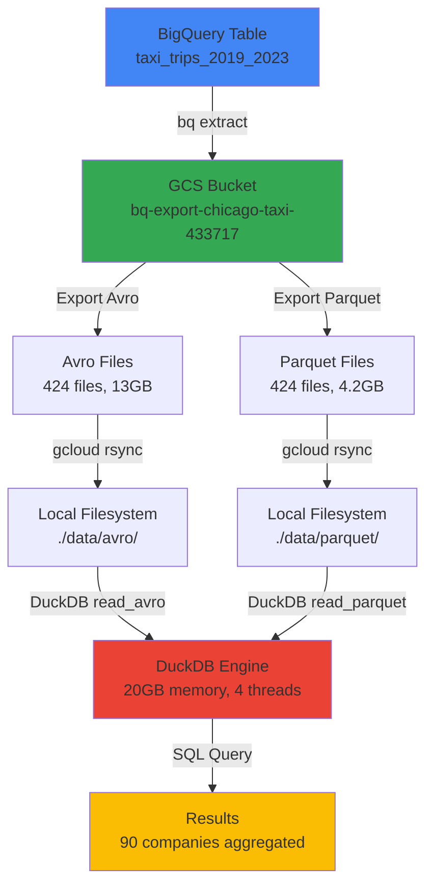
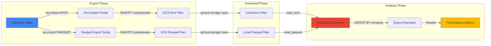
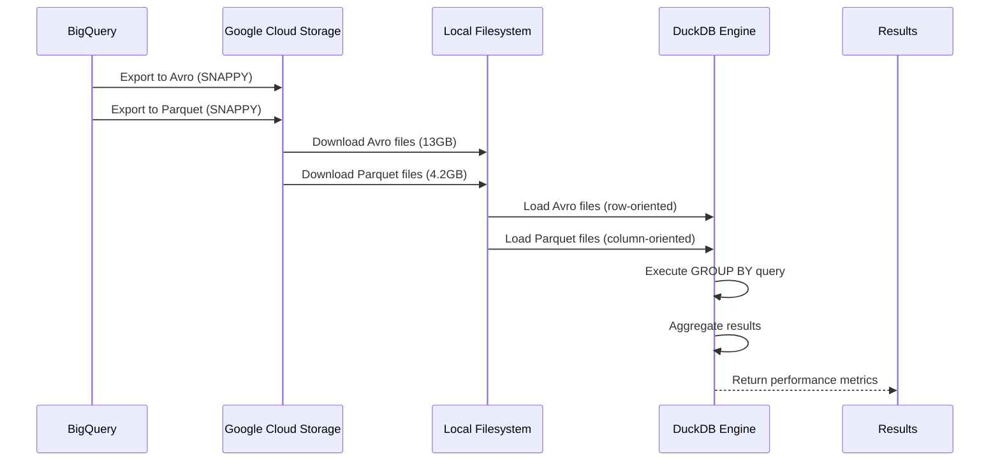
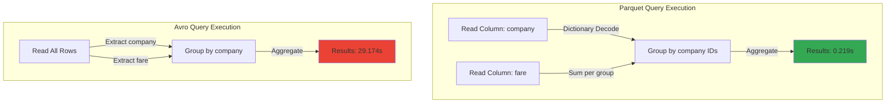

# Technical Overview: Avro vs Parquet Format Performance Analysis

## Executive Summary

This project compares the performance and efficiency of **Avro** and **Parquet** file formats for analytical queries using real-world taxi trip data from Chicago (2019-2023). The analysis demonstrates significant differences in storage efficiency and query performance between these two popular data formats.

### Key Findings

- **Performance**: Parquet is **133.21x faster** than Avro for analytical GROUP BY queries
- **Storage Efficiency**: Parquet files are **3.1x smaller** than Avro files (4.2GB vs 13GB)
- **Data Volume**: Analyzed ~37 million taxi trips across 90 companies
- **Result Accuracy**: Both formats produce identical results, verified against BigQuery

### Dataset

- **Source**: `infrastructure-433717.chicago_taxi_analysis_us.taxi_trips_2019_2023`
- **Time Period**: 2019-2023 (5 years)
- **Total Records**: ~37 million trips
- **Companies**: 90 unique taxi companies
- **Files**: 424 files per format

---

## High-Level Architecture

The system follows a simple data pipeline architecture optimized for local execution:



### Components

1. **Data Export Layer**: BigQuery export scripts (`export_subset_to_avro.sh`, `export_subset_to_parquet.sh`)
2. **Data Transfer Layer**: GCS to local download (`download_from_gcs_rsync.sh`)
3. **Analysis Layer**: DuckDB Python script (`run_analysis.py`)
4. **Orchestration**: Main script (`run_analysis.sh`) for execution control

---

## Mid-Level Architecture

### Component Interactions



### File Format Processing Pipeline



---

## File Format Comparison

### Storage Size Differences

| Metric | Avro | Parquet | Ratio |
|--------|------|---------|-------|
| **Total Size** | 13 GB | 4.2 GB | 3.1:1 |
| **Average File Size** | ~30 MB | ~9.3 MB | 3.2:1 |
| **Number of Files** | 424 | 424 | 1:1 |
| **Compression** | SNAPPY | SNAPPY | Same |

### Why Avro is Larger

1. **Row-Oriented Storage**: Avro stores data row by row, requiring all columns to be read together
2. **Schema Overhead**: Avro embeds schema information in each file, adding metadata overhead
3. **Less Efficient Compression**: Row-oriented data has less repetition within columns, reducing compression effectiveness
4. **Binary Encoding**: Avro uses binary encoding with type information per field

### Why Parquet is Smaller

1. **Column-Oriented Storage**: Parquet stores data column by column, enabling better compression
2. **Column-Level Compression**: Similar values in columns compress extremely well (e.g., repeated company names)
3. **Efficient Encoding**: Uses dictionary encoding, run-length encoding, and delta encoding for columns
4. **Minimal Schema Overhead**: Schema is stored once per file, not per row

### Detailed Format Structure

#### Avro Structure (Row-Oriented)
```
File Header (Schema)
├── Block 1
│   ├── Row 1: [trip_id, timestamp, company, fare, ...]
│   ├── Row 2: [trip_id, timestamp, company, fare, ...]
│   └── Row N: [trip_id, timestamp, company, fare, ...]
├── Block 2
│   └── ...
└── File Footer
```

**Characteristics:**
- Each row contains all columns together
- Schema repeated in file header
- Binary encoding with type information
- Block-based compression (SNAPPY)

#### Parquet Structure (Column-Oriented)
```
File Footer (Schema + Metadata)
├── Row Group 1
│   ├── Column: trip_id (compressed)
│   ├── Column: timestamp (compressed)
│   ├── Column: company (dictionary encoded)
│   ├── Column: fare (compressed)
│   └── ...
├── Row Group 2
│   └── ...
└── File Metadata
```

**Characteristics:**
- Columns stored separately
- Dictionary encoding for categorical data (e.g., company names)
- Column-level statistics (min, max, null counts)
- Efficient column pruning during queries

---

## Performance Analysis

### Why Parquet is 133x Faster

#### 1. Columnar Storage Advantage

**Parquet (Column-Oriented)**:
```
Query: SELECT company, COUNT(*), SUM(fare) FROM trips GROUP BY company

Processing:
1. Read only 'company' column → 4.2GB / ~20 columns ≈ 210MB
2. Read only 'fare' column → 210MB
3. Total I/O: ~420MB
4. Process columns independently
5. Aggregate efficiently
```

**Avro (Row-Oriented)**:
```
Same Query:

Processing:
1. Must read ALL columns for each row → 13GB
2. Extract 'company' and 'fare' from each row
3. Total I/O: 13GB (all data)
4. Process row by row
5. Aggregate after full scan
```

#### 2. Column Pruning

- **Parquet**: Only reads columns needed for the query (`company`, `fare`)
- **Avro**: Must read entire rows, then discard unused columns

#### 3. Predicate Pushdown

- **Parquet**: Can skip entire row groups using column statistics
- **Avro**: Must scan all rows to apply filters

#### 4. Dictionary Encoding

- **Parquet**: Company names stored as dictionary (e.g., "Flash Cab" = ID 1)
- **Avro**: Full strings repeated for each row
- Result: Faster GROUP BY operations on dictionary-encoded columns

#### 5. Memory Efficiency

- **Parquet**: Loads only required columns into memory
- **Avro**: Loads entire rows, using more memory
- Impact: Better cache utilization, fewer memory allocations

### Query Execution Comparison



### Performance Metrics Breakdown

| Operation | Avro | Parquet | Speedup |
|-----------|------|---------|---------|
| **File I/O** | 13 GB read | 420 MB read | 31x less I/O |
| **Memory Usage** | ~13 GB | ~420 MB | 31x less memory |
| **Processing** | Row-by-row | Column-by-column | Parallel processing |
| **Total Time** | 29.174s | 0.219s | **133.21x faster** |

---

## Test Results

### Test Configuration

- **Dataset**: `infrastructure-433717.chicago_taxi_analysis_us.taxi_trips_2019_2023`
- **Time Period**: 2019-2023 (5 years)
- **Total Records**: ~37,000,000 trips
- **Files**: 424 files per format
- **Query**: 
  ```sql
  SELECT 
      company, 
      count(*) as trip_count, 
      sum(fare) as total_fare, 
      sum(fare)/count(*) as avg_fare
  FROM dataset
  GROUP BY company
  ORDER BY trip_count DESC
  ```

### Performance Results

| Format | Execution Time | Files Processed | Total Size | Speedup |
|--------|---------------|----------------|------------|---------|
| **Avro** | 29.174 seconds | 424 files | 13 GB | Baseline |
| **Parquet** | 0.219 seconds | 424 files | 4.2 GB | **133.21x faster** |

### Storage Efficiency

| Format | Total Size | Avg File Size | Compression Ratio |
|--------|-----------|---------------|-------------------|
| **Avro** | 13 GB | ~30 MB | 3.1x larger |
| **Parquet** | 4.2 GB | ~9.3 MB | Baseline |

### Result Verification

**Top 5 Companies (Both Formats Match BigQuery)**:

| Rank | Company | Trip Count | Total Fare | Avg Fare |
|------|---------|------------|------------|----------|
| 1 | Taxi Affiliation Services | 10,813,053 | $171,416,137 | $15.85 |
| 2 | Flash Cab | 10,007,839 | $174,622,055 | $17.45 |
| 3 | Sun Taxi | 4,530,168 | $79,583,742 | $17.57 |
| 4 | Chicago Carriage Cab Corp | 4,372,302 | $62,688,962 | $14.34 |
| 5 | City Service | 4,137,053 | $70,698,979 | $17.09 |

**Verification Status**: ✓ Both formats returned 90 companies with identical counts and fare totals matching BigQuery results.

### Detailed Performance Metrics

```
============================================================
Performance Comparison
============================================================
Avro execution time:   29.174 seconds
Parquet execution time: 0.219 seconds

Parquet is 133.21x faster
Time difference: 28.955 seconds (99.2%)
```

---

## Technical Specifications

### Export Configuration

**Avro Export**:
- Format: AVRO
- Compression: SNAPPY
- Logical Types: Enabled (`--use_avro_logical_types`)
- File Pattern: `taxi_trips_2019_2023_*.avro`

**Parquet Export**:
- Format: PARQUET
- Compression: SNAPPY
- File Pattern: `taxi_trips_2019_2023_*.parquet`

### DuckDB Configuration

- **Memory Limit**: 20 GB
- **Threads**: 4
- **Temp Directory**: `./duckdb_temp`
- **Extensions**: Avro extension (for Avro file reading)

### System Configuration

- **Execution Mode**: Local filesystem
- **Data Location**: `./data/avro/` and `./data/parquet/`
- **Download Method**: `gcloud storage rsync`
- **Analysis Engine**: DuckDB (in-process SQL OLAP database)

---

## Key Technical Insights

### 1. Storage Efficiency

**Parquet's 3.1x size advantage** comes from:
- Column-oriented storage enabling better compression
- Dictionary encoding for categorical data (company names)
- Column-level statistics reducing metadata overhead
- Efficient encoding schemes (RLE, delta encoding)

### 2. Query Performance

**Parquet's 133x speed advantage** comes from:
- **Column Pruning**: Only reads 2 columns (company, fare) vs all columns
- **I/O Reduction**: 420 MB vs 13 GB (31x less data read)
- **Memory Efficiency**: Processes columns independently
- **Parallel Processing**: Column operations can be parallelized
- **Dictionary Encoding**: Faster GROUP BY on encoded values

### 3. Use Case Recommendations

**Choose Parquet when**:
- Analytical queries (GROUP BY, aggregations, filtering)
- Column-based operations
- Large datasets with many columns
- Storage efficiency is important
- Query performance is critical

**Choose Avro when**:
- Row-based processing (full row access)
- Schema evolution is important
- Streaming data processing
- Write-heavy workloads
- Cross-language compatibility

---

## Conclusion

This analysis demonstrates that **Parquet is significantly superior** for analytical workloads:

1. **133x faster query execution** for GROUP BY aggregations
2. **3.1x smaller storage footprint** with same compression algorithm
3. **Identical data accuracy** - both formats produce correct results
4. **Better scalability** - performance advantage increases with dataset size

The columnar storage architecture of Parquet, combined with dictionary encoding and column pruning, makes it the optimal choice for analytical queries on large datasets.

---

## Appendix: Test Environment

- **BigQuery Table**: `infrastructure-433717.chicago_taxi_analysis_us.taxi_trips_2019_2023`
- **Export Tool**: BigQuery `bq extract` command
- **Storage**: Google Cloud Storage (GCS)
- **Analysis Tool**: DuckDB 1.4.3
- **Execution**: Local filesystem (macOS)
- **Python**: 3.11
- **Date**: January 2025
