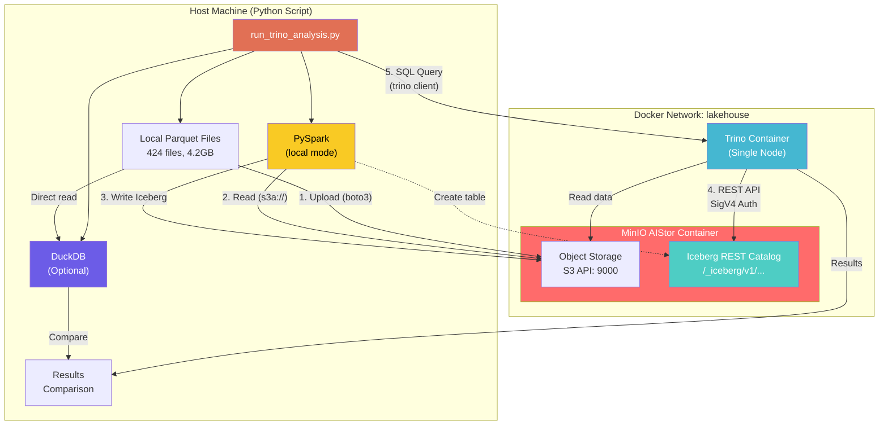
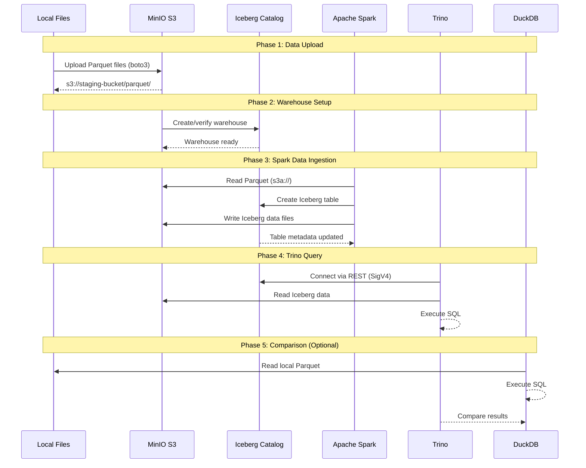

# AIStor Tables Integration Test Guide

## Overview

This document describes the `run_trino_analysis.py` test script, which demonstrates end-to-end integration of **MinIO AIStor Tables** (native Apache Iceberg REST Catalog) with **Apache Spark** for data ingestion and **Trino** for distributed SQL analytics.

### Purpose

The test validates:
1. Data ingestion into Iceberg tables via Spark
2. SQL querying via Trino with AIStor's native Iceberg REST Catalog
3. Performance comparison between Trino/Iceberg and DuckDB

### Key Technologies

| Component | Role | Runs On |
|-----------|------|---------|
| MinIO AIStor | Object storage + Iceberg REST Catalog | Docker container |
| Apache Spark (PySpark) | Data ingestion (Parquet → Iceberg) | Host machine (local mode) |
| Trino | SQL query engine | Docker container |
| Apache Iceberg | Table format | - |
| DuckDB | Local SQL engine (comparison) | Host machine |
| Python script | Orchestration (`run_trino_analysis.py`) | Host machine |

---

## Architecture

### System Overview



### Data Flow



---

## Deployment

### Docker Compose Stack

**File**: `docker/docker-compose.yaml`

```yaml
services:
  minio:
    image: ${MINIO_TEST_IMAGE:-quay.io/minio/aistor/minio:EDGE}
    hostname: minio
    command: server --console-address ":9001" /data
    ports:
      - "9000:9000"   # S3 API
      - "9001:9001"   # Console
    environment:
      MINIO_LICENSE: ${MINIO_LICENSE}
      MINIO_ROOT_USER: minioadmin
      MINIO_ROOT_PASSWORD: minioadmin
    healthcheck:
      test: ["CMD", "curl", "-f", "http://localhost:9000/minio/health/live"]
      interval: 5s
      timeout: 10s
      retries: 5
      start_period: 10s

  trino:
    image: ${TRINO_IMAGE:-trinodb/trino:477}
    hostname: trino
    environment:
      - CATALOG_MANAGEMENT=dynamic
    depends_on:
      minio:
        condition: service_healthy
    healthcheck:
      test: ["CMD", "curl", "-I", "http://localhost:8080/v1/status"]
      interval: 2s
      timeout: 10s
      retries: 5
      start_period: 10s
    ports:
      - "9999:8080"   # Trino REST API

networks:
  lakehouse:

volumes:
  minio_data:
```

### Start Commands

```bash
./scripts/start_services.sh
```

### Stop Commands

```bash
./scripts/stop_services.sh        # Preserve data
./scripts/stop_services.sh --clean  # Remove all data
```

### Network Architecture

> **CRITICAL**: The script uses TWO different MinIO hostnames:
> - `MINIO_HOST = "http://localhost:9000"` — for Python/Spark on host
> - `MINIO_HOST_FOR_TRINO = "http://minio:9000"` — for Trino in Docker

---

## Spark Configuration

### Complete Spark Session Setup

Spark is configured to connect to AIStor's Iceberg REST Catalog with SigV4 authentication:

```python
spark = (
    SparkSession.builder
    .appName("AIStor Tables - Trino Analysis")
    
    # JAR Dependencies
    .config("spark.jars.packages",
            "org.apache.iceberg:iceberg-spark-runtime-4.0_2.13:1.10.1,"
            "org.apache.iceberg:iceberg-aws-bundle:1.10.1,"
            "org.apache.hadoop:hadoop-aws:3.3.4")
    
    # Iceberg SQL Extensions
    .config("spark.sql.extensions",
            "org.apache.iceberg.spark.extensions.IcebergSparkSessionExtensions")
    
    # Catalog Configuration
    .config("spark.sql.catalog.tutorial_catalog", "org.apache.iceberg.spark.SparkCatalog")
    .config("spark.sql.catalog.tutorial_catalog.type", "rest")
    .config("spark.sql.catalog.tutorial_catalog.uri", "http://localhost:9000/_iceberg")
    .config("spark.sql.catalog.tutorial_catalog.warehouse", "trinotutorial")
    
    # REST Endpoint Credentials (for SigV4)
    .config("spark.sql.catalog.tutorial_catalog.rest.endpoint", "http://localhost:9000")
    .config("spark.sql.catalog.tutorial_catalog.rest.access-key-id", "minioadmin")
    .config("spark.sql.catalog.tutorial_catalog.rest.secret-access-key", "minioadmin")
    
    # SigV4 Authentication
    .config("spark.sql.catalog.tutorial_catalog.rest.sigv4-enabled", "true")
    .config("spark.sql.catalog.tutorial_catalog.rest.signing-name", "s3tables")
    .config("spark.sql.catalog.tutorial_catalog.rest.signing-region", "us-east-1")
    
    # S3 Data Access
    .config("spark.sql.catalog.tutorial_catalog.s3.access-key-id", "minioadmin")
    .config("spark.sql.catalog.tutorial_catalog.s3.secret-access-key", "minioadmin")
    .config("spark.sql.catalog.tutorial_catalog.s3.endpoint", "http://localhost:9000")
    .config("spark.sql.catalog.tutorial_catalog.s3.path-style-access", "true")
    
    .getOrCreate()
)
```

### Java Version Compatibility

**CRITICAL**: Spark requires Java 8-21. Java 24+ causes:
```
java.lang.UnsupportedOperationException: getSubject is not supported
```

**Fix**:
```bash
# Install Java 21
brew install openjdk@21

# Set JAVA_HOME
export JAVA_HOME=/opt/homebrew/opt/openjdk@21
export PATH="$JAVA_HOME/bin:$PATH"
```

---

## Trino Configuration

### Dynamic Catalog Creation

Trino connects to AIStor using a dynamically created Iceberg catalog:

```sql
CREATE CATALOG tutorial_catalog USING iceberg
WITH (
    -- Catalog Type
    "iceberg.catalog.type" = 'rest',
    "iceberg.rest-catalog.uri" = 'http://minio:9000/_iceberg',
    "iceberg.rest-catalog.warehouse" = 'trinotutorial',
    
    -- Security (SigV4)
    "iceberg.rest-catalog.security" = 'SIGV4',
    "iceberg.rest-catalog.signing-name" = 's3tables',
    "iceberg.rest-catalog.vended-credentials-enabled" = 'true',
    "iceberg.rest-catalog.view-endpoints-enabled" = 'true',
    
    -- S3 Configuration
    "s3.region" = 'dummy',
    "s3.aws-access-key" = 'minioadmin',
    "s3.aws-secret-key" = 'minioadmin',
    "s3.endpoint" = 'http://minio:9000',
    "s3.path-style-access" = 'true',
    
    -- Filesystem
    "fs.hadoop.enabled" = 'false',
    "fs.native-s3.enabled" = 'true'
);
```

---

## Test Execution Flow

### Analysis Query

```sql
SELECT 
    company, 
    count(*) as trip_count, 
    sum(fare) as total_fare, 
    sum(fare)/count(*) as avg_fare
FROM tutorial_catalog.taxi_analysis.taxi_trips_iceberg
GROUP BY company
ORDER BY trip_count DESC
```

---

## Troubleshooting

### Common Issues

#### 1. "Cannot obtain metadata" Error

**Cause**: Trino is trying to reach MinIO using `localhost:9000` instead of `minio:9000`.

**Fix**: Ensure `MINIO_HOST_FOR_TRINO` is set to `http://minio:9000` in the Trino catalog creation.

#### 2. Spark Java Compatibility

**Symptom**: `java.lang.UnsupportedOperationException: getSubject is not supported`

**Fix**: Use Java 8-21:
```bash
export JAVA_HOME=/opt/homebrew/opt/openjdk@21
```

#### 3. S3A NumberFormatException

**Symptom**: `java.lang.NumberFormatException: For input string: "60s"`

**Fix**: Use milliseconds:
```python
.config("spark.hadoop.fs.s3a.connection.timeout", "60000")  # Not "60s"
```

### Validation Commands

```bash
# Check MinIO health
curl http://localhost:9000/minio/health/live

# Check Trino health
curl http://localhost:9999/v1/status

# Trino CLI query
docker exec -it trino trino --execute "SHOW CATALOGS"
```

---

## Performance Results

### Test Environment

- **Dataset**: ~58 million taxi trips
- **Files**: 424 Parquet files (4.2GB total)
- **Query**: GROUP BY company with aggregations
- **Trino Configuration**: Single-node deployment

### Results

| Engine | Execution Time | Notes |
|--------|----------------|-------|
| **DuckDB** | 0.193s | Local, in-process |
| **Trino/Iceberg** | 0.465s | Single-node Docker, via REST catalog |

### Observations

- DuckDB is **2.41x faster** for single-node local queries
- Trino includes network overhead (Docker containers)
- Trino advantage emerges with distributed cluster and larger datasets
- Iceberg provides ACID, time travel, schema evolution

---

## Files Reference

| File | Purpose |
|------|---------|
| `analysis/run_trino_analysis.py` | Main test script |
| `analysis/sigv4.py` | SigV4 authentication for REST API |
| `scripts/run_trino_analysis.sh` | Shell wrapper with env vars |
| `scripts/start_services.sh` | Start MinIO + Trino services |
| `scripts/stop_services.sh` | Stop services |
| `docker/docker-compose.yaml` | MinIO + Trino deployment |
| `docker/.env` | Environment configuration |
| `docker/.env.example` | Environment template |

---

## Conclusion

This test demonstrates a complete data lakehouse architecture using:

1. **MinIO AIStor** as unified object storage with native Iceberg catalog
2. **Apache Spark** for scalable data ingestion
3. **Trino** (single-node) for interactive SQL analytics
4. **Apache Iceberg** as the open table format

The architecture enables:
- **Decoupled storage and compute**
- **Multiple query engines** on the same data
- **ACID transactions** on object storage
- **Schema evolution** without data rewriting
- **Time travel** for data versioning
