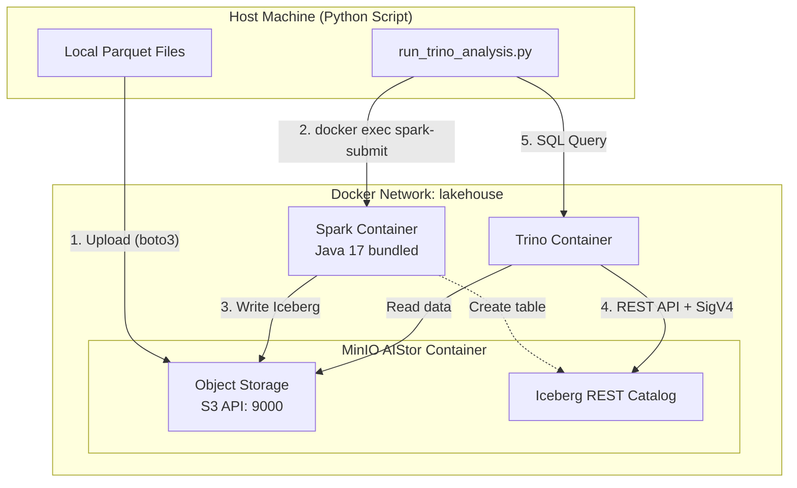

# AIStor Tables Analysis

Test MinIO AIStor Tables (native Iceberg) integration with Apache Spark and Trino.

## Overview

This project demonstrates end-to-end integration of **MinIO AIStor Tables** (native Apache Iceberg REST Catalog) with:
- **Apache Spark** for data ingestion (Parquet → Iceberg)
- **Trino** for distributed SQL analytics

### Key Technologies

| Component | Role | Runs On |
|-----------|------|---------|
| MinIO AIStor | Object storage + Iceberg REST Catalog | Docker container |
| Apache Spark | Data ingestion (Parquet → Iceberg) | Docker container (Java 17 bundled) |
| Trino | SQL query engine | Docker container |
| Apache Iceberg | Table format | - |

## Quick Start

### Prerequisites

- Python 3.11+
- Docker and Docker Compose
- MinIO AIStor license

> **Note**: No Java installation required - Spark runs in a Docker container with Java 17 bundled.

### Setup

1. **Install dependencies**:
   ```bash
   pip install -r requirements.txt
   ```

2. **Configure environment**:
   ```bash
   cp docker/.env.example docker/.env
   # Edit docker/.env and add your MINIO_LICENSE
   ```

3. **Start services**:
   ```bash
   ./scripts/start_services.sh
   ```

4. **Generate test data** (recommended):
   ```bash
   ./scripts/generate_synthetic_data.py           # 1M rows (default)
   ./scripts/generate_synthetic_data.py --rows 5  # 5M rows
   ```

   Or download real Chicago taxi data from GCS (requires GCP access):
   ```bash
   ./scripts/download_from_gcs_rsync.sh
   ```

5. **Run analysis**:
   ```bash
   ./scripts/run_trino_analysis.sh
   ```

### Stop Services

```bash
./scripts/stop_services.sh        # Preserve data
./scripts/stop_services.sh --clean  # Remove all data
```

## Architecture



### Data Flow

1. **Upload**: Parquet files uploaded to MinIO staging bucket (boto3)
2. **Spark Ingestion**: Read from staging → Write to Iceberg table
3. **Trino Query**: Execute SQL against Iceberg table via REST catalog

## Project Structure

```
aistor-tables-analysis/
├── analysis/
│   ├── run_trino_analysis.py    # Main analysis script
│   ├── spark_ingest.py          # Spark ingestion (runs in container)
│   └── sigv4.py                 # SigV4 authentication
├── docker/
│   ├── docker-compose.yaml      # MinIO + Trino + Spark services
│   ├── .env.example             # Environment template
│   └── .env                     # Your configuration (gitignored)
├── scripts/
│   ├── start_services.sh        # Start Docker services
│   ├── stop_services.sh         # Stop Docker services
│   ├── run_trino_analysis.sh    # Run analysis
│   ├── generate_synthetic_data.py  # Generate test data
│   └── download_from_gcs_rsync.sh  # Download from GCS (optional)
├── data/                        # Local Parquet files (gitignored)
├── requirements.txt
└── README.md
```

## Configuration

### Environment Variables

| Variable | Default | Description |
|----------|---------|-------------|
| `TRINO_URI` | `http://localhost:9999` | Trino REST API |
| `MINIO_HOST` | `http://localhost:9000` | MinIO S3 endpoint |
| `MINIO_ACCESS_KEY` | `minioadmin` | MinIO access key |
| `MINIO_SECRET_KEY` | `minioadmin` | MinIO secret key |
| `WAREHOUSE` | `trinotutorial` | Iceberg warehouse name |
| `PARQUET_DIR` | `./data/parquet` | Local Parquet files |

## Spark Configuration

Spark runs inside a Docker container with Java 17 bundled. The Python script invokes Spark via `docker exec`:

```bash
docker exec docker-spark-1 spark-submit \
    --packages org.apache.iceberg:iceberg-spark-runtime-3.5_2.12:1.6.1,... \
    /app/analysis/spark_ingest.py \
    --warehouse trinotutorial \
    --minio-host http://minio:9000
```

Spark connects to AIStor's Iceberg REST Catalog with SigV4 authentication. See `analysis/spark_ingest.py` for the full configuration.

## Trino Configuration

Trino connects via dynamically created Iceberg catalog:

```sql
CREATE CATALOG tutorial_catalog USING iceberg
WITH (
    "iceberg.catalog.type" = 'rest',
    "iceberg.rest-catalog.uri" = 'http://minio:9000/_iceberg',
    "iceberg.rest-catalog.warehouse" = 'trinotutorial',
    "iceberg.rest-catalog.security" = 'SIGV4',
    "iceberg.rest-catalog.signing-name" = 's3tables',
    "s3.endpoint" = 'http://minio:9000',
    "s3.path-style-access" = 'true'
);
```

> **Note**: Trino uses `http://minio:9000` (Docker network) while Spark/Python use `http://localhost:9000`.

## Troubleshooting

### "Cannot obtain metadata" Error

**Cause**: Trino trying to reach MinIO using wrong hostname.

**Fix**: Ensure Trino catalog uses `http://minio:9000` (Docker network name).

### Spark Container Not Running

**Symptom**: `Error: No such container: docker-spark-1`

**Fix**: Make sure services are started with `./scripts/start_services.sh`

### Validation Commands

```bash
# Check MinIO health
curl http://localhost:9000/minio/health/live

# Check Trino health
curl http://localhost:9999/v1/status

# Trino CLI query
docker exec -it docker-trino-1 trino --execute "SHOW CATALOGS"

# Check Spark container
docker exec docker-spark-1 /opt/spark/bin/spark-submit --version
```

## Performance Results

| Engine | Execution Time | Notes |
|--------|----------------|-------|
| Trino/Iceberg | ~1.1s | Single-node Docker, via REST catalog |

### Benefits of Iceberg

- ACID transactions on object storage
- Schema evolution without data rewriting
- Time travel for data versioning
- Multiple query engines on same data
