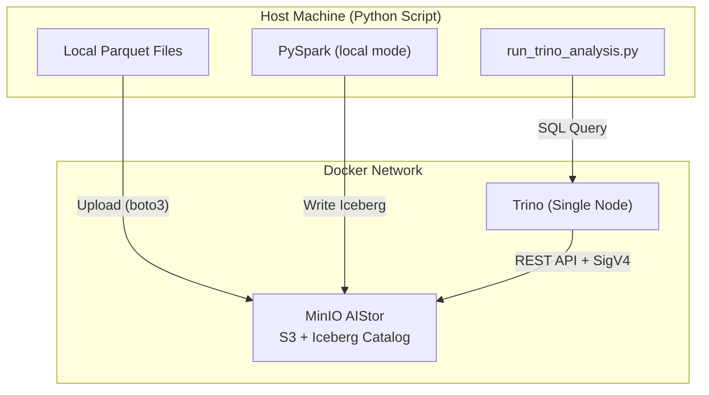

# AIStor Tables Analysis

Test MinIO AIStor Tables (native Iceberg) integration with Apache Spark and Trino.

## Overview

This project demonstrates end-to-end integration of **MinIO AIStor Tables** (native Apache Iceberg REST Catalog) with:
- **Apache Spark** for data ingestion (Parquet → Iceberg)
- **Trino** for distributed SQL analytics
- **DuckDB** for performance comparison (optional)

### Key Technologies

| Component | Role |
|-----------|------|
| MinIO AIStor | Object storage + Iceberg REST Catalog |
| Apache Spark (PySpark) | Data ingestion |
| Trino | SQL query engine |
| Apache Iceberg | Table format |

## Quick Start

### Prerequisites

- Python 3.11+
- Docker and Docker Compose
- Java 8-21 (Java 24+ incompatible with Spark)
- MinIO AIStor license

### Setup

1. **Install dependencies**:
   ```bash
   pip install -r requirements.txt
   ```

2. **Configure environment**:
   ```bash
   cp docker/.env.example docker/.env
   # Edit docker/.env and add your MINIO_LICENSE
   ```

3. **Start services**:
   ```bash
   ./scripts/start_services.sh
   ```

4. **Download test data** (optional):
   ```bash
   ./scripts/download_from_gcs_rsync.sh
   ```

5. **Run analysis**:
   ```bash
   ./scripts/run_trino_analysis.sh
   ```

### Stop Services

```bash
./scripts/stop_services.sh        # Preserve data
./scripts/stop_services.sh --clean  # Remove all data
```

## Project Structure

```
aistor-tables-analysis/
├── analysis/
│   ├── __init__.py
│   ├── run_trino_analysis.py    # Main analysis script
│   └── sigv4.py                 # SigV4 authentication
├── docker/
│   ├── docker-compose.yaml      # MinIO + Trino services
│   ├── .env.example             # Environment template
│   └── .env                     # Your configuration (gitignored)
├── scripts/
│   ├── start_services.sh        # Start Docker services
│   ├── stop_services.sh         # Stop Docker services
│   ├── run_trino_analysis.sh    # Run analysis
│   └── download_from_gcs_rsync.sh
├── data/                        # Local Parquet files (gitignored)
├── requirements.txt
├── README.md
├── AISTOR_TABLES_TEST_GUIDE.md
└── DOCUMENTATION_ANALYSIS.md
```

## Architecture



## Data Flow

1. **Upload**: Parquet files uploaded to MinIO staging bucket
2. **Warehouse Setup**: Create/verify Iceberg warehouse via REST API
3. **Spark Ingestion**: Load Parquet → Write to Iceberg table
4. **Trino Query**: Execute SQL against Iceberg table
5. **Results**: Compare with DuckDB (optional)

## Configuration

### Environment Variables

| Variable | Default | Description |
|----------|---------|-------------|
| `TRINO_URI` | `http://localhost:9999` | Trino REST API |
| `MINIO_HOST` | `http://localhost:9000` | MinIO S3 endpoint |
| `MINIO_ACCESS_KEY` | `minioadmin` | MinIO access key |
| `MINIO_SECRET_KEY` | `minioadmin` | MinIO secret key |
| `WAREHOUSE` | `trinotutorial` | Iceberg warehouse name |
| `PARQUET_DIR` | `./data/parquet` | Local Parquet files |
| `COMPARE_WITH_DUCKDB` | `false` | Enable DuckDB comparison |

### Java Version

Spark requires Java 8-21. If using Java 24+, install Java 21:

```bash
# macOS
brew install openjdk@21
export JAVA_HOME=/opt/homebrew/opt/openjdk@21

# Linux
sudo apt install openjdk-21-jdk
export JAVA_HOME=/usr/lib/jvm/java-21-openjdk
```

## Documentation

- [AISTOR_TABLES_TEST_GUIDE.md](AISTOR_TABLES_TEST_GUIDE.md) - Detailed test guide
- [DOCUMENTATION_ANALYSIS.md](DOCUMENTATION_ANALYSIS.md) - AIStor documentation gaps analysis

## Performance Results

| Engine | Execution Time | Notes |
|--------|----------------|-------|
| DuckDB | 0.193s | Local, in-process |
| Trino/Iceberg | 0.465s | Single-node Docker |

DuckDB is **2.41x faster** for single-node queries, but Trino provides:
- Distributed query processing
- ACID transactions
- Schema evolution
- Time travel
