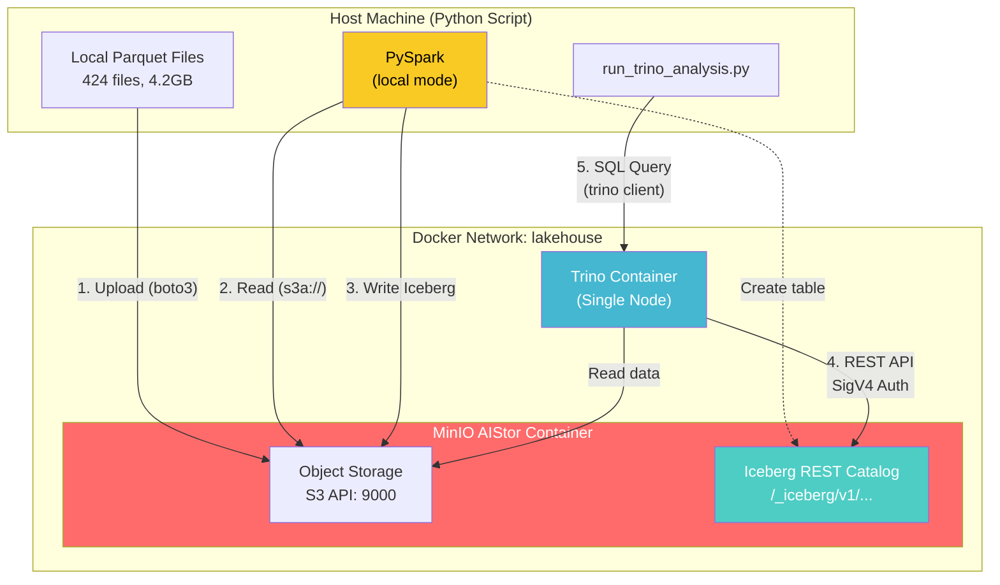

# AIStor Tables Analysis

Test MinIO AIStor Tables (native Iceberg) integration with Apache Spark and Trino.

## Overview

This project demonstrates end-to-end integration of **MinIO AIStor Tables** (native Apache Iceberg REST Catalog) with:
- **Apache Spark** for data ingestion (Parquet → Iceberg)
- **Trino** for distributed SQL analytics

### Key Technologies

| Component | Role | Runs On |
|-----------|------|---------|
| MinIO AIStor | Object storage + Iceberg REST Catalog | Docker container |
| Apache Spark (PySpark) | Data ingestion (Parquet → Iceberg) | Host machine (local mode) |
| Trino | SQL query engine | Docker container |
| Apache Iceberg | Table format | - |

## Quick Start

### Prerequisites

- Python 3.11+
- Docker and Docker Compose
- Java 8-21 (Java 24+ incompatible with Spark)
- MinIO AIStor license

### Setup

1. **Install dependencies**:
   ```bash
   pip install -r requirements.txt
   ```

2. **Configure environment**:
   ```bash
   cp docker/.env.example docker/.env
   # Edit docker/.env and add your MINIO_LICENSE
   ```

3. **Start services**:
   ```bash
   ./scripts/start_services.sh
   ```

4. **Download test data** (if needed):
   ```bash
   ./scripts/download_from_gcs_rsync.sh
   ```

5. **Run analysis**:
   ```bash
   ./scripts/run_trino_analysis.sh
   ```

### Stop Services

```bash
./scripts/stop_services.sh        # Preserve data
./scripts/stop_services.sh --clean  # Remove all data
```

## Architecture



### Data Flow

1. **Upload**: Parquet files uploaded to MinIO staging bucket (boto3)
2. **Spark Ingestion**: Read from staging → Write to Iceberg table
3. **Trino Query**: Execute SQL against Iceberg table via REST catalog

## Project Structure

```
aistor-tables-analysis/
├── analysis/
│   ├── run_trino_analysis.py    # Main analysis script
│   └── sigv4.py                 # SigV4 authentication
├── docker/
│   ├── docker-compose.yaml      # MinIO + Trino services
│   ├── .env.example             # Environment template
│   └── .env                     # Your configuration (gitignored)
├── scripts/
│   ├── start_services.sh        # Start Docker services
│   ├── stop_services.sh         # Stop Docker services
│   ├── run_trino_analysis.sh    # Run analysis
│   └── download_from_gcs_rsync.sh
├── data/                        # Local Parquet files (gitignored)
├── requirements.txt
└── README.md
```

## Configuration

### Environment Variables

| Variable | Default | Description |
|----------|---------|-------------|
| `TRINO_URI` | `http://localhost:9999` | Trino REST API |
| `MINIO_HOST` | `http://localhost:9000` | MinIO S3 endpoint |
| `MINIO_ACCESS_KEY` | `minioadmin` | MinIO access key |
| `MINIO_SECRET_KEY` | `minioadmin` | MinIO secret key |
| `WAREHOUSE` | `trinotutorial` | Iceberg warehouse name |
| `PARQUET_DIR` | `./data/parquet` | Local Parquet files |

### Java Version

Spark requires Java 8-21. Java 24+ causes:
```
java.lang.UnsupportedOperationException: getSubject is not supported
```

**Fix**:
```bash
# macOS
brew install openjdk@21
export JAVA_HOME=/opt/homebrew/opt/openjdk@21

# Linux
sudo apt install openjdk-21-jdk
export JAVA_HOME=/usr/lib/jvm/java-21-openjdk
```

## Spark Configuration

Spark connects to AIStor's Iceberg REST Catalog with SigV4 authentication:

```python
spark = (
    SparkSession.builder
    .config("spark.jars.packages",
            "org.apache.iceberg:iceberg-spark-runtime-4.0_2.13:1.10.1,"
            "org.apache.iceberg:iceberg-aws-bundle:1.10.1,"
            "org.apache.hadoop:hadoop-aws:3.3.4")
    
    # Catalog Configuration
    .config("spark.sql.catalog.tutorial_catalog", "org.apache.iceberg.spark.SparkCatalog")
    .config("spark.sql.catalog.tutorial_catalog.type", "rest")
    .config("spark.sql.catalog.tutorial_catalog.uri", "http://localhost:9000/_iceberg")
    .config("spark.sql.catalog.tutorial_catalog.warehouse", "trinotutorial")
    
    # SigV4 Authentication
    .config("spark.sql.catalog.tutorial_catalog.rest.sigv4-enabled", "true")
    .config("spark.sql.catalog.tutorial_catalog.rest.signing-name", "s3tables")
    .config("spark.sql.catalog.tutorial_catalog.rest.signing-region", "us-east-1")
    
    .getOrCreate()
)
```

## Trino Configuration

Trino connects via dynamically created Iceberg catalog:

```sql
CREATE CATALOG tutorial_catalog USING iceberg
WITH (
    "iceberg.catalog.type" = 'rest',
    "iceberg.rest-catalog.uri" = 'http://minio:9000/_iceberg',
    "iceberg.rest-catalog.warehouse" = 'trinotutorial',
    "iceberg.rest-catalog.security" = 'SIGV4',
    "iceberg.rest-catalog.signing-name" = 's3tables',
    "s3.endpoint" = 'http://minio:9000',
    "s3.path-style-access" = 'true'
);
```

> **Note**: Trino uses `http://minio:9000` (Docker network) while Spark/Python use `http://localhost:9000`.

## Troubleshooting

### "Cannot obtain metadata" Error

**Cause**: Trino trying to reach MinIO using wrong hostname.

**Fix**: Ensure Trino catalog uses `http://minio:9000` (Docker network name).

### Spark Java Compatibility

**Symptom**: `java.lang.UnsupportedOperationException: getSubject is not supported`

**Fix**: Use Java 8-21 (see Java Version section above).

### S3A NumberFormatException

**Symptom**: `java.lang.NumberFormatException: For input string: "60s"`

**Fix**: Use milliseconds in Spark config:
```python
.config("spark.hadoop.fs.s3a.connection.timeout", "60000")  # Not "60s"
```

### Validation Commands

```bash
# Check MinIO health
curl http://localhost:9000/minio/health/live

# Check Trino health
curl http://localhost:9999/v1/status

# Trino CLI query
docker exec -it docker-trino-1 trino --execute "SHOW CATALOGS"
```

## Performance Results

| Engine | Execution Time | Notes |
|--------|----------------|-------|
| Trino/Iceberg | ~1.1s | Single-node Docker, via REST catalog |

### Benefits of Iceberg

- ACID transactions on object storage
- Schema evolution without data rewriting
- Time travel for data versioning
- Multiple query engines on same data
