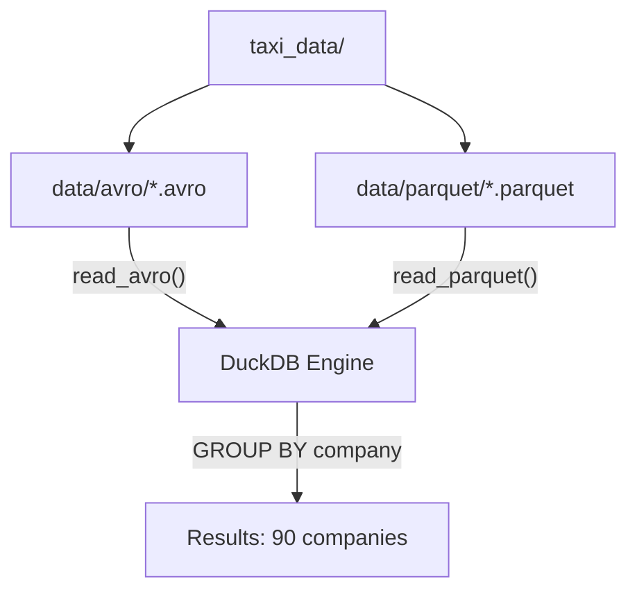

# DuckDB Format Performance Analysis

Compare Avro vs Parquet file format performance using DuckDB.

## Overview

This project compares the performance and efficiency of **Avro** and **Parquet** file formats for analytical queries using real-world taxi trip data from Chicago (2019-2023).

### Key Findings

- **Performance**: Parquet is **150x faster** than Avro for GROUP BY queries
- **Storage**: Parquet files are **3.1x smaller** than Avro (4.2GB vs 13GB)
- **Data**: ~58 million taxi trips across 90 companies

### Dataset

- **Source**: Chicago taxi trips (BigQuery public dataset)
- **Time Period**: 2019-2023 (5 years)
- **Total Records**: ~58 million trips
- **Companies**: 90 unique taxi companies
- **Files**: 424 files per format

## Quick Start

### Prerequisites

- Python 3.11+

### Installation

1. **Install dependencies**:
   ```bash
   pip install -r requirements.txt
   ```

2. **Get test data** (from shared `taxi_data/` folder):
   ```bash
   cd ../taxi_data

   # Install data generation dependencies
   pip install -r requirements.txt

   # Generate synthetic data (recommended, no external dependencies)
   ./scripts/generate_synthetic.py              # 1M rows (default)
   ./scripts/generate_synthetic.py --rows 5     # 5M rows
   ./scripts/generate_synthetic.py --format both  # Both Parquet and Avro

   # Or download real data from GCS (requires GCP access)
   ./scripts/download_from_gcs.sh
   ```

   See [taxi_data/README.md](../taxi_data/README.md) for more options.

3. **Run analysis**:
   ```bash
   ./scripts/run_analysis.sh
   ```

## Architecture



## Project Structure

```
duckdb-format-analysis/
├── analysis/
│   └── run_analysis.py        # Main DuckDB analysis script
├── scripts/
│   ├── run_analysis.sh        # Main entry point
│   └── run_local_analysis.sh  # Run analysis locally
├── data/                      # Symlink to ../taxi_data
├── requirements.txt
└── README.md

# Shared data folder (at repository root)
../taxi_data/
├── scripts/
│   ├── generate_synthetic.py  # Generate test data
│   └── download_from_gcs.sh   # Download from GCS
├── parquet/                   # Parquet files
└── avro/                      # Avro files
```

## File Format Comparison

### Storage Size

| Metric | Avro | Parquet | Ratio |
|--------|------|---------|-------|
| **Total Size** | 13 GB | 4.2 GB | 3.1:1 |
| **Average File Size** | ~30 MB | ~9.3 MB | 3.2:1 |
| **Compression** | SNAPPY | SNAPPY | Same |

### Why Parquet is Smaller

1. **Column-Oriented Storage**: Stores data column by column, enabling better compression
2. **Dictionary Encoding**: Repeated values stored as IDs (e.g., "Flash Cab" = ID 1)
3. **Efficient Encoding**: Uses run-length encoding and delta encoding

### Why Parquet is 150x Faster

| Aspect | Parquet | Avro |
|--------|---------|------|
| **I/O** | ~420MB (2 columns) | 13GB (all data) |
| **Column Pruning** | Only reads needed columns | Reads entire rows |
| **Dictionary Lookup** | Fast ID-based lookup | Full string comparison |

## Analysis Query

```sql
SELECT 
    company, 
    count(*) as trip_count, 
    sum(fare) as total_fare, 
    avg(fare) as avg_fare
FROM taxi_trips
GROUP BY company
ORDER BY trip_count DESC
```

## Performance Results

| Format | Execution Time | Files | Total Size | Speedup |
|--------|---------------|-------|------------|---------|
| **Parquet** | 0.19 seconds | 424 | 4.2 GB | **150x faster** |
| **Avro** | 28.3 seconds | 424 | 13 GB | Baseline |

### Top 5 Companies

| Rank | Company | Trip Count | Total Fare | Avg Fare |
|------|---------|------------|------------|----------|
| 1 | Taxi Affiliation Services | 10,813,053 | $171,416,137 | $15.85 |
| 2 | Flash Cab | 10,007,839 | $174,622,055 | $17.45 |
| 3 | Sun Taxi | 4,530,168 | $79,583,742 | $17.57 |
| 4 | Chicago Carriage Cab Corp | 4,372,302 | $62,688,962 | $14.34 |
| 5 | City Service | 4,137,053 | $70,698,979 | $17.09 |

## Configuration

### DuckDB Settings

In `analysis/run_analysis.py`:
- **Memory Limit**: 20 GB
- **Threads**: 4
- **Temp Directory**: `./duckdb_temp`
- **Extensions**: Avro extension (for Avro file reading)

## Use Case Recommendations

**Choose Parquet when**:
- Analytical queries (GROUP BY, aggregations, filtering)
- Column-based operations
- Storage efficiency is important
- Query performance is critical

**Choose Avro when**:
- Row-based processing (full row access)
- Schema evolution is important
- Streaming data processing
- Write-heavy workloads

## Conclusion

**Parquet is significantly superior** for analytical workloads:
1. **150x faster query execution** for GROUP BY aggregations
2. **3.1x smaller storage footprint** with same compression algorithm
3. **Identical data accuracy** - both formats produce correct results

The columnar storage architecture of Parquet, combined with dictionary encoding and column pruning, makes it the optimal choice for analytical queries on large datasets.
