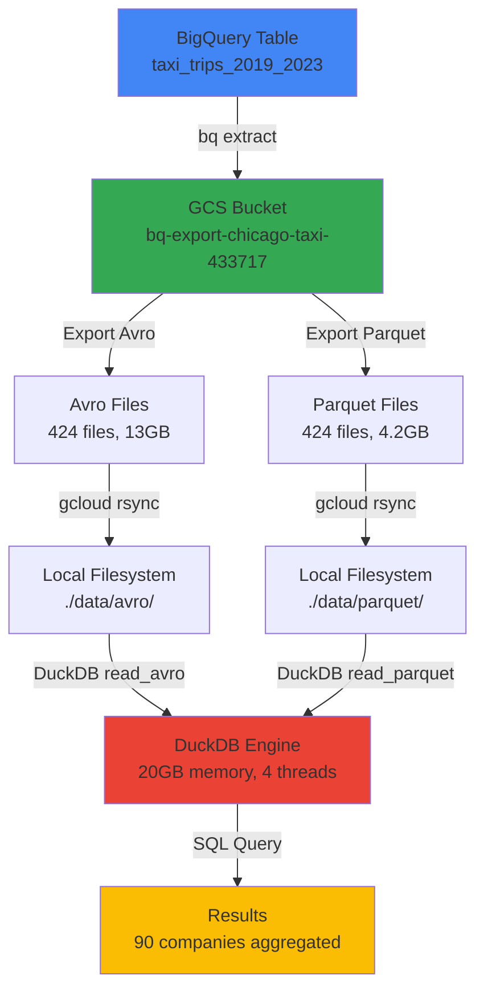

# Technical Overview: Avro vs Parquet Format Performance Analysis

## Executive Summary

This project compares the performance and efficiency of **Avro** and **Parquet** file formats for analytical queries using real-world taxi trip data from Chicago (2019-2023). The analysis demonstrates significant differences in storage efficiency and query performance between these two popular data formats.

### Key Findings

- **Performance**: Parquet is **150x faster** than Avro for analytical GROUP BY queries
- **Storage Efficiency**: Parquet files are **3.1x smaller** than Avro files (4.2GB vs 13GB)
- **Data Volume**: Analyzed ~58 million taxi trips across 90 companies

### Dataset

- **Source**: `infrastructure-433717.chicago_taxi_analysis_us.taxi_trips_2019_2023`
- **Time Period**: 2019-2023 (5 years)
- **Total Records**: ~58 million trips
- **Companies**: 90 unique taxi companies
- **Files**: 424 Parquet files (4.2GB)

---

## High-Level Architecture



### Components

1. **Data Source**: Pre-exported Avro and Parquet files in GCS bucket
2. **Data Transfer**: GCS to local download (`download_from_gcs_rsync.sh`)
3. **Analysis Engine**: DuckDB Python script (`run_analysis.py`)
4. **Orchestration**: Main script (`run_analysis.sh`)

---

## File Format Comparison

### Storage Size Differences

| Metric | Avro | Parquet | Ratio |
|--------|------|---------|-------|
| **Total Size** | 13 GB | 4.2 GB | 3.1:1 |
| **Average File Size** | ~30 MB | ~9.3 MB | 3.2:1 |
| **Number of Files** | 424 | 424 | 1:1 |
| **Compression** | SNAPPY | SNAPPY | Same |

### Why Parquet is Smaller

1. **Column-Oriented Storage**: Stores data column by column, enabling better compression
2. **Column-Level Compression**: Similar values in columns compress extremely well
3. **Efficient Encoding**: Uses dictionary encoding, run-length encoding, and delta encoding
4. **Minimal Schema Overhead**: Schema is stored once per file, not per row

### Why Avro is Larger

1. **Row-Oriented Storage**: Stores data row by row, requiring all columns to be read together
2. **Schema Overhead**: Avro embeds schema information in each file
3. **Less Efficient Compression**: Row-oriented data has less repetition within columns

---

## Performance Analysis

### Why Parquet is 150x Faster

#### 1. Columnar Storage Advantage

**Parquet (Column-Oriented)**:
- Only reads columns needed for query (`company`, `fare`)
- Total I/O: ~420MB (2 columns)

**Avro (Row-Oriented)**:
- Must read ALL columns for each row
- Total I/O: 13GB (all data)

#### 2. Column Pruning

- **Parquet**: Only reads columns needed for the query
- **Avro**: Must read entire rows, then discard unused columns

#### 3. Dictionary Encoding

- **Parquet**: Company names stored as dictionary (e.g., "Flash Cab" = ID 1)
- **Avro**: Full strings repeated for each row

### Performance Metrics

| Operation | Avro | Parquet | Speedup |
|-----------|------|---------|---------|
| **File I/O** | 13 GB read | 420 MB read | 31x less I/O |
| **Total Time** | 28.3s | 0.19s | **150x faster** |

---

## Test Results

### Test Configuration

- **Query**: 
  ```sql
  SELECT 
      company, 
      count(*) as trip_count, 
      sum(fare) as total_fare, 
      sum(fare)/count(*) as avg_fare
  FROM dataset
  GROUP BY company
  ORDER BY trip_count DESC
  ```

### Performance Results

| Format | Execution Time | Files Processed | Total Size | Speedup |
|--------|---------------|----------------|------------|---------|
| **Avro** | 28.3 seconds | 424 files | 13 GB | Baseline |
| **Parquet** | 0.19 seconds | 424 files | 4.2 GB | **150x faster** |

### Top 5 Companies (Results Match)

| Rank | Company | Trip Count | Total Fare | Avg Fare |
|------|---------|------------|------------|----------|
| 1 | Taxi Affiliation Services | 10,813,053 | $171,416,137 | $15.85 |
| 2 | Flash Cab | 10,007,839 | $174,622,055 | $17.45 |
| 3 | Sun Taxi | 4,530,168 | $79,583,742 | $17.57 |
| 4 | Chicago Carriage Cab Corp | 4,372,302 | $62,688,962 | $14.34 |
| 5 | City Service | 4,137,053 | $70,698,979 | $17.09 |

---

## Technical Specifications

### DuckDB Configuration

- **Memory Limit**: 20 GB
- **Threads**: 4
- **Temp Directory**: `./duckdb_temp`
- **Extensions**: Avro extension (for Avro file reading)

### Export Configuration

**Avro Export**:
- Format: AVRO
- Compression: SNAPPY
- Logical Types: Enabled

**Parquet Export**:
- Format: PARQUET
- Compression: SNAPPY

---

## Use Case Recommendations

**Choose Parquet when**:
- Analytical queries (GROUP BY, aggregations, filtering)
- Column-based operations
- Storage efficiency is important
- Query performance is critical

**Choose Avro when**:
- Row-based processing (full row access)
- Schema evolution is important
- Streaming data processing
- Write-heavy workloads

---

## Conclusion

**Parquet is significantly superior** for analytical workloads:
1. **150x faster query execution** for GROUP BY aggregations
2. **3.1x smaller storage footprint** with same compression algorithm
3. **Identical data accuracy** - both formats produce correct results

The columnar storage architecture of Parquet, combined with dictionary encoding and column pruning, makes it the optimal choice for analytical queries on large datasets.
